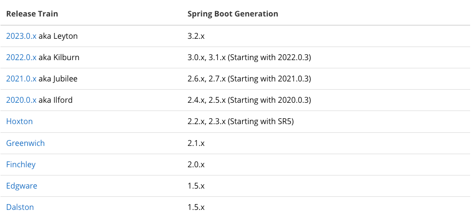

= Spring Cloud

== Spring Cloud란?

____
Spring Cloud provides tools for developers to quickly build some of the common patterns in distributed systems (e.g. configuration management, service discovery, circuit breakers, intelligent routing, micro-proxy, control bus, short lived microservices and contract testing). Coordination of distributed systems leads to boiler plate patterns, and using Spring Cloud developers can quickly stand up services and applications that implement those patterns. They will work well in any distributed environment, including the developer’s own laptop, bare metal data centres, and managed platforms such as Cloud Foundry.
____

* Spring Cloud는 분산 시스템(MSA 환경)에서 일부 공통 패턴을 신속하게 구축할 수 있는 도구를 제공한다.

== Features

* Distributed/versioned configuration
* Service registration and discovery
* Routing
* Service-to-service calls
* Load balancing
* Circuit Breakers
* Distributed messaging
* Short lived microservices (tasks)
* Consumer-driven and producer-driven contract testing

== Spring Cloud Release
* latest version : 2023.0.0
* https://github.com/spring-cloud/spring-cloud-release/wiki

=== Spring Cloud BOM

* Spring Boot 2.7  --> 2021.0.8
** https://github.com/spring-cloud/spring-cloud-release/wiki/Spring-Cloud-2021.0-Release-Notes

[source,xml]
----
<properties>
    <spring-cloud.version>2021.0.8</spring-cloud.version>
</properties>

<dependencyManagement>
    <dependencies>
        <dependency>
            <groupId>org.springframework.cloud</groupId>
            <artifactId>spring-cloud-dependencies</artifactId>
            <version>${spring-cloud.version}</version>
            <type>pom</type>
            <scope>import</scope>
        </dependency>
    </dependencies>
</dependencyManagement>
----

* Spring Boot 3.3.x  --> 2023.0.2
** https://github.com/spring-cloud/spring-cloud-release/wiki/Supported-Versions#supported-releases

[source,xml]
----
<properties>
    <spring-cloud.version>2023.0.2</spring-cloud.version>
</properties>

<dependencyManagement>
    <dependencies>
        <dependency>
            <groupId>org.springframework.cloud</groupId>
            <artifactId>spring-cloud-dependencies</artifactId>
            <version>${spring-cloud.version}</version>
            <type>pom</type>
            <scope>import</scope>
        </dependency>
    </dependencies>
</dependencyManagement>
----

* USE

[source,xml]
----
<dependencies>
    <dependency>
        <groupId>org.springframework.cloud</groupId>
        <artifactId>spring-cloud-starter-config</artifactId>
    </dependency>
    <dependency>
        <groupId>org.springframework.cloud</groupId>
        <artifactId>spring-cloud-starter-netflix-eureka-client</artifactId>
    </dependency>
    ...
</dependencies>
----

== Project에서 사용할  Stack
* https://spring.io/projects/spring-cloud-gateway[Spring Cloud Gateway]
* https://spring.io/projects/spring-cloud-netflix[Spring Cloud Netflix Eureka]
* https://spring.io/projects/spring-cloud-openfeign[Spring Cloud OpenFeign]

== Reference
* https://spring.io/projects/spring-cloud