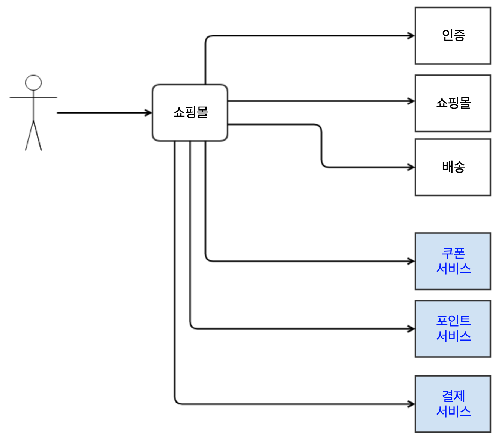
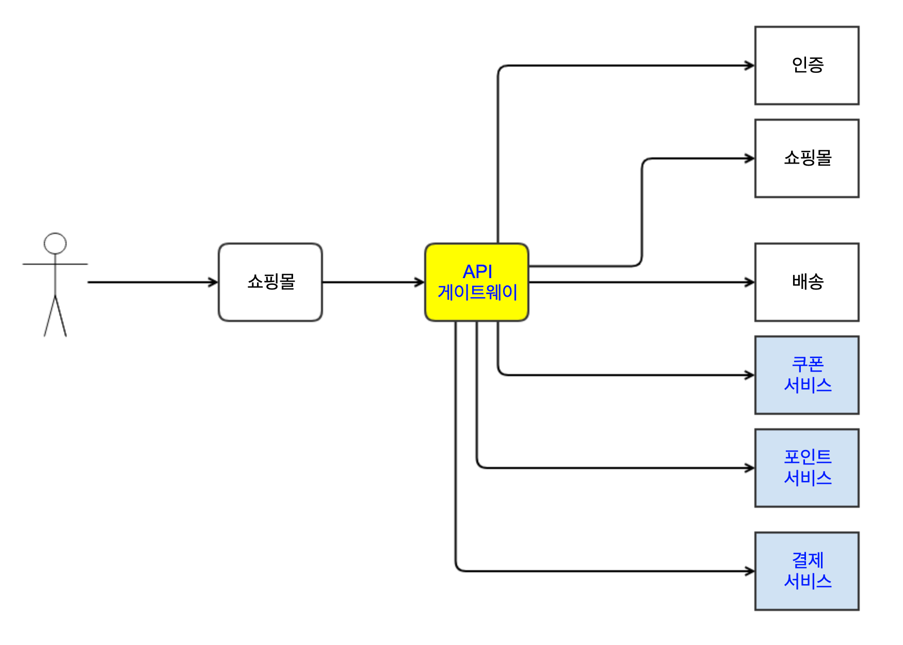
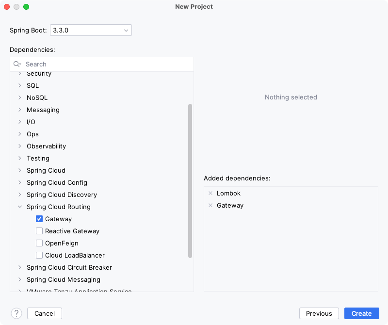

= API Gateway Pattern

* 여러 클라이언트가 여러 개의 서비스를 호출한다면 매우 복잡한 호출관계가 만들어질 것입니다. 이러한 복잡성을 낮추기위한 방법이 필요합니다.

== 새로운 서비스가 추가된다면?
* 쿠폰서비스
* 포인트서비스
* 결제서비스
* .....

== 서비스 흐름 제어(라우팅)

* Hardware : L4 스위치
* Software : Haproxy, API 게이트웨이
** application level의 제어, 직접 커스텀 할 수 있음
** 라우팅
** 로드벨런싱
** 인증/인가
** 장애 격리
** 서비스 탐색

== Spring Cloud Gateway

* https://spring.io/projects/spring-cloud-gateway
* Dependency
** Lombok
** Gateway

=== Dependency

[source,xml]
----
<dependency>
    <groupId>org.springframework.cloud</groupId>
    <artifactId>spring-cloud-starter-gateway</artifactId>
</dependency>
----

* Router Configuration

[source,java]
----
@Configuration
public class RouterConfig {

    @Bean
    public RouteLocator customRouteLocator(RouteLocatorBuilder builder){
        return builder.routes()
                .route("get_route", r -> r.path("/get")
                        .filters(o->o.addRequestHeader("uuid", UUID.randomUUID().toString()))
                        .uri("http://httpbin.org"))
                .build();
    }
}
----

=== Netty

* Spring Cloud Gateway는 tomcat이 아닌 Netty를 사용하고 있습니다.
** 비동기 Web application Server
** 1 Thread Many Request를 처리합니다.
** Tomcat 처럼 1-Thread 1-Request보다는 많은 요청을 처리할 수 있습니다.

=== 작동 방식

* 클라이언트가 Spring Cloud Gateway에 요청합니다.
* Gateway Handler Mapping이 라우트 조건에 일치한다면 Gateway Web Handler로 보내줍니다.
* Gateway Web Handler는 요청과 관련된 필터들을 통해서 요청을 처리합니다.
* 해당 필터들은 체이닝되어 있으며 proxied service들로 요청이 보내기 전/후로 로직을 실행합니다.

image:resources/image-4.png[]

==== Route
* 고유 ID, URI, Predicate, Filter로 구성되어 있습니다. ( 위 Sample Code를 참고해주세요)
* Gateway로 요청된 URI 조건이 일치할 경우  맵핑되어 있는 uri로  전송합니다.
** Sample Code에서는
*** 맵핑 : r.path("/get")
*** uri 전송 : .uri("http://httpbin.org")

==== Predicate

* 조건이 만족하는지 체크 합니다.
* 공식문서를 참고해주세요
** 12개 Predicate Factory가 존재합니다.
*** https://docs.spring.io/spring-cloud-gateway/docs/current/reference/html/#gateway-request-predicates-factories
*** ex1) query 가 green 매개변수가 포함된 경우
**** https://docs.spring.io/spring-cloud-gateway/docs/current/reference/html/#the-query-route-predicate-factory

[source,yaml]
----
spring:
  cloud:
    gateway:
      routes:
      - id: query_route
        uri: https://example.org
        predicates:
        - Query=green
----

==== Filter

* Request(요청), Response(응답)에 대해서 작업을 할수있게 해주는 구성요소 입니다.
* 37개의 다양한 Filter가 존재합니다.
** https://docs.spring.io/spring-cloud-gateway/docs/current/reference/html/#gatewayfilter-factories
**  ex) Request에 header추가하기 : X-Request-red에 blue값을 추가합니다.
*** https://docs.spring.io/spring-cloud-gateway/docs/current/reference/html/#the-addrequestheader-gatewayfilter-factory

[source,yaml]
----
spring:
  cloud:
    gateway:
      routes:
      - id: add_request_header_route
        uri: https://example.org
        filters:
        - AddRequestHeader=X-Request-red, blue
----

==== Custom Gateway Filter
* https://cloud.spring.io/spring-cloud-gateway/multi/multi__developer_guide.html
----
AbstractGatewayFilterFactory<PreGatewayFilterFactory.Config>
----

