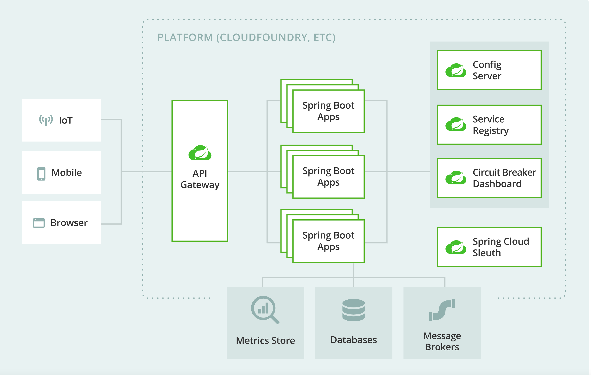

= Service Discovery Pattern

== Service Discovery
* 분산 환경 위에서 서로간의 서비스를 원격 호출하기 위해서는 각 서비스의 IP 주소와 PORT 를 알아야 호출이 가능합니다.
* 클라우드 기반의 MSA 어플리케이션인 경우에 네트워크 주소가( {server-ip}:{server-port} ) 동적(dynamic)으로 할당됩니다.
* 클라이언트가 서비스를 호출하기위해서 서비스를 찾는 매커니즘이 필요합니다.
* 주요기능
** 서비스를 등록하고 등록된 서비스 목록을 반환
** health check를 통해서 현재 서비스가 가능한 서비스를 판별한 후, 서비스 가능한 목록을 제공
** 서비스간의 부하 분산 비율을 조정

== Client side discovery
* Service Client가 Service registry에서 서비스의 위치를 찾아서 호출하는 방식
* Spring Cloud LoadBalancer
** https://spring.io/guides/gs/spring-cloud-loadbalancer/

== Server side discovery
* proxy server(Load Balancer, Spring Cloud Gateway)를 제공하고, 제공된 proxy server (Spring Cloud Gateway) 를 호출하면 Service registry(Eureka)로 부터 등록된 서비스의 위치를 기반으로 라우팅하는 방식

== Service registry
* Service Discovery를 하기위한 중요한 역할
* 사용가능한 서비스 인스턴스의 목록을 관리
* 서비스 등록,해제,조회 API 제공
* Netflix Eureka

== Eureka Server REST operations
* https://github.com/Netflix/eureka/wiki/Eureka-REST-operations

|===
|Operation | HTTP action | Description

|인스턴스 등록
|POST
| /eureka/v2/apps/appID	Input: JSON/XML payload HTTP Code: 204 on success

|인스턴스 삭제
|DELETE
|/eureka/v2/apps/appID/instanceID	HTTP Code: 200 on success

|모든 인스턴스
|GET
|/eureka/v2/apps	HTTP Code: 200 on success Output: JSON/XML

|특정 인스턴스
|GET
|/eureka/v2/apps/appID	HTTP Code: 200 on success Output: JSON/XML

|===

== Eureka Client -  ApplicationInfoManager
* eureka 서버에 등록하기 위해 필요한 정보를 초기화하고 다른 컴포넌트에 의해서 발견되는 클래스

=== void setInstanceStatus()

* 인스턴스의 상태를 설정
* application은 status를 이용하여 트래픽을 수신할 준비가 되어있는지 여부를 나타넬 수 있습니다.
* setInstanceStatus method를 이용하여 상태를 변경하면 모든 리스너에게 상태 변경 이벤트를 알립니다.

[source,java]
----
public synchronized void setInstanceStatus(InstanceStatus status) {
    InstanceStatus next = instanceStatusMapper.map(status);
    if (next == null) {
        return;
    }

    InstanceStatus prev = instanceInfo.setStatus(next);
    if (prev != null) {
        for (StatusChangeListener listener : listeners.values()) {
            try {
                listener.notify(new StatusChangeEvent(prev, next));
            } catch (Exception e) {
                logger.warn("failed to notify listener: {}", listener.getId(), e);
            }
        }
    }
}
----

* Eureka Client <--> Server Communication
** https://github.com/Netflix/eureka/wiki/Understanding-eureka-client-server-communication

